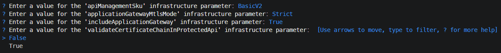

# mTLS with Azure API Management

> [!WARNING]  
> This template is under construction


> TODO intro

> [!WARNING]  
> This repository intentionally includes self-signed certificates (including private keys) **for local development and demo/template convenience only**.
> In real-world scenarios, **never** commit certificates with private keys to source control.
> Use proper secret/certificate management and generate certificates as part of your secure environment/tooling.
> We included these files here to keep this template easy to use without adding an extra dependency on certificate generation tools (for example, OpenSSL).


> [!IMPORTANT]  
> This template is not production-ready; it uses minimal cost SKUs and omits network isolation, advanced security, governance and resiliency. Harden security, implement enterprise controls and/or replace modules with [Azure Verified Modules](https://azure.github.io/Azure-Verified-Modules/) before any production use.

## Getting Started

### Prerequisites

Before you can deploy this template, make sure you have the following tools installed and the necessary permissions.

**Required Tools:**

- [Azure Developer CLI (azd)](https://learn.microsoft.com/en-us/azure/developer/azure-developer-cli/install-azd)
  - Installing `azd` also installs the following tools:
    - [GitHub CLI](https://cli.github.com)
    - [Bicep CLI](https://learn.microsoft.com/en-us/azure/azure-resource-manager/bicep/install)

**Required Permissions:**

- You need **Owner** permissions, or a combination of **Contributor** and **Role Based Access Control Administrator** permissions on an Azure Subscription to deploy this template.

**Optional Prerequisites:**

To build and run the [integration tests](#integration-tests) locally, you need the following additional tools:

- [.NET 10 SDK](https://dotnet.microsoft.com/en-us/download/dotnet/10.0)

### Deployment

Once the prerequisites are installed on your machine, you can deploy this template using the following steps:

1. Run the `azd init` command in an empty directory with the `--template` parameter to clone this template into the current directory.

   ```cmd
   azd init --template ronaldbosma/mtls-with-apim
   ```

   When prompted, specify the name of the environment, for example, `mtlsapim`. The maximum length is 32 characters.

1. Run the `azd auth login` command to authenticate to your Azure subscription using the **Azure Developer CLI** _(if you haven't already)_.

   ```cmd
   azd auth login
   ```

1. Run the `az login` command to authenticate to your Azure subscription using the **Azure CLI** _(if you haven't already)_. This is required for the [hooks](#hooks) to function properly. Make sure to log into the same tenant as the Azure Developer CLI.

   ```cmd
   az login
   ```

1. Before deploying, review the [Configuration](#configuration) section for useful options such as selecting the API Management SKU, enabling certificate chain validation for the protected API, and including or excluding Application Gateway.

1. Run the `azd up` command to provision the resources in your Azure subscription.

   ```cmd
   azd up
   ```

   During the first deployment of a new environment, you'll be prompted to specify configuration settings for this template.

   

   The value of `applicationGatewayMtlsMode` will be ignored if the Application Gateway is not included. See [Configuration](#configuration) for more details about these parameters, how they are stored and how to change them later.

   See [Troubleshooting](#troubleshooting) if you encounter any issues during deployment.

1. Once the deployment is complete, you can locally modify the application or infrastructure and run `azd up` again to update the resources in Azure.

### Demo

See the [Demo Guide](demos/demo.md) for a step-by-step walkthrough on how to check and demonstrate different mTLS scenarios with API Management.

### Clean up

Once you're done and want to clean up, run the `azd down` command. By including the `--purge` parameter, you ensure that the API Management service and Log Analytics workspace don't remain in a soft-deleted state, which could cause issues with future deployments of the same environment.

```cmd
azd down --purge
```

## Configuration

During the first deployment of a new environment, `azd up` prompts you to select the values for the template configuration settings.
The values are stored in `.azure/<environment-name>/config.json`.
During deployment, the values are stored as environment variables in `.azure/<environment-name>/.env` and used by deployments and integration tests.

If an environment was deployed before and later removed with `azd down`, the environment variables are removed from `.azure/<environment-name>/.env` but the selected values are still stored in `.azure/<environment-name>/config.json` and reused as defaults for clean/initial deployments of that environment.

Use one of the following approaches to change values:

1. Use `azd env set` before deployment to override a value for the next deployment.
1. Update `.azure/<environment-name>/config.json` to change the default values used for consecutive clean/initial deployments.

Environment variables take precedence over values in `config.json`.

### API Management SKU

The SKU of the API Management service is configured through the `apiManagementSku` parameter in [main.parameters.json](/infra/02-platform/main.parameters.json). During the first deployment of a new environment, you're prompted to specify this value.

To change it to a different value, like `Developer`, run the following command:

```cmd
azd env set AZURE_API_MANAGEMENT_SKU Developer
```

If API Management is already deployed, you cannot change the SKU across tier families in place (for example, from `BasicV2` to `Developer`). See [Troubleshooting](#troubleshooting) for resolution options.

> [!NOTE]
> Certificate chain validation is not supported on v2 tier APIM instances. See [Validate client certificate chain in Protected API](#validate-client-certificate-chain-in-protected-api) for more details.

### Validate client certificate chain in Protected API

During the first deployment of a new environment, you're prompted to specify whether the Protected API should validate the client certificate chain. This feature is not supported on v2 tier APIM instances because they [do not support uploading CA certificates](https://learn.microsoft.com/en-us/azure/api-management/api-management-howto-ca-certificates). If you enable it on a v2 tier APIM instance, requests that use the self-signed client certificates from this repository will always return `401 Unauthorized`, because APIM will try to validate the certificate chain but the CA chain is not available to APIM.

It can be enabled through the `validateCertificateChainInProtectedApi` parameter in [main.parameters.json](/infra/03-application/main.parameters.json).

To enable it, run the following command:

```cmd
azd env set VALIDATE_CERTIFICATE_CHAIN_IN_PROTECTED_API true
```

If you have already deployed the template, you only have to redeploy the application layer to apply the change: 

```cmd
azd provision application
```

### Include Application Gateway

Whether the Application Gateway is included in the deployment is configured through the `includeApplicationGateway` parameter in [main.parameters.json](/infra/01-core/main.parameters.json) (core layer) and [main.parameters.json](/infra/02-platform/main.parameters.json) (platform layer). During the first deployment of a new environment, you're prompted to specify this value.

To exclude the Application Gateway and related resources, run the following command:

```cmd
azd env set INCLUDE_APPLICATION_GATEWAY false
```

Note that the Application Gateway will not be removed if it's already deployed, this setting is disabled, and `azd up` or `azd provision` is executed again. You will need to manually remove the resources from the Azure portal or use `azd down --purge` to remove the entire environment.

If the Application Gateway is currently not deployed and you change this setting to `true`, redeploy both the core and platform layer to apply the change:

```cmd
azd provision core
azd provision platform
```

### Application Gateway mTLS Mode

The mTLS mode for Application Gateway is configured through the `applicationGatewayMtlsMode` parameter in [main.parameters.json](/infra/02-platform/main.parameters.json). During the first deployment of a new environment, you're prompted to specify this value.

Supported values:

- `Strict`: Application Gateway enforces client certificate authentication during the TLS handshake by requiring a valid client certificate.
- `Passthrough`: Application Gateway requests a client certificate during the TLS handshake but doesn't terminate the connection if the certificate is missing or invalid. The connection to the backend proceeds regardless of the certificate's presence or validity.

To change the mode to `Passthrough`, run the following command:

```cmd
azd env set AZURE_APPLICATION_GATEWAY_MTLS_MODE Passthrough
```

If you have already deployed the template, redeploy the platform layer to apply the change:

```cmd
azd provision platform
```

## Contents

The repository consists of the following files and directories:

```
├── .devcontainer              [ Development container configuration files ]
├── .github
│   └── workflows              [ GitHub Actions workflow(s) ]
├── .vscode                    [ Visual Studio Code configuration files ]
├── demos                      [ Demo guide(s) ]
├── images                     [ Images used in the README ]
├── infra                      [ Infrastructure As Code files ]
│   ├── 01-core                [ Core layer that deploys App Insights, Key Vault, etc. ]
│   ├── 02-platform            [ Platform layer that deploys VNet, Application Gateway and API Management ]
│   ├── 03-application         [ Application layer that deploys application infrastructure resources ]
│   └── 99-shared              [ Reusable modules, user-defined functions and user-defined types ]
├── self-signed-certificates   [ Self-signed certificates used in mTLS scenarios ]
├── tests
│   ├── IntegrationTests       [ Integration tests for automatically verifying different scenarios ]
│   └── tests.http             [ HTTP requests to test the deployed resources ]
├── azure.yaml                 [ Describes the apps and types of Azure resources ]
└── bicepconfig.json           [ Bicep configuration file ]
```

## Hooks

This template has several hooks that are executed at different stages of the deployment process. The following hooks are included:

### Post-provision hooks - Core layer

These PowerShell scripts are executed after the the core layer is provisioned.

- [postprovision-create-agw-server-certificate.ps1](infra/01-core/hooks/postprovision-create-agw-server-certificate.ps1):  
  This script creates a self-signed SSL server certificate for the IP address of the Application Gateway in Key Vault.

- [postprovision-import-client-certificates.ps1](infra/01-core/hooks/postprovision-import-client-certificates.ps1):  
  This script imports the necessary certificates into Key Vault.

## Pipeline

This template includes a GitHub Actions workflow that automates the build, deployment and cleanup process. The workflow is defined in [azure-dev.yml](.github/workflows/azure-dev.yml) and provides a complete CI/CD pipeline for this template using the Azure Developer CLI.


The pipeline consists of the following jobs:

- **Build, Verify and Package**: This job sets up the build environment, validates the Bicep template and packages the integration tests.
- **Deploy to Azure**: This job provisions the Azure infrastructure and deploys the packaged applications to the created resources.
- **Verify Deployment**: This job runs automated [integration tests](#integration-tests) on the deployed resources to verify correct functionality.
- **Clean Up Resources**: This job removes all deployed Azure resources.

  By default, cleanup runs automatically after the deployment. This can be disabled via an input parameter when the workflow is triggered manually.

  

For draft PRs, only the 'Build, Verify and Package' job is executed to avoid deploying from work-in-progress branches. When the PR is marked ready for review, the workflow will trigger and execute all jobs.

See [GitHub Actions Workflow for Azure Developer CLI (azd) Templates](https://ronaldbosma.github.io/blog/2026/03/02/github-actions-workflow-for-azure-developer-cli-azd-templates/) for a detailed explanation of the workflow.

### Setting Up the Pipeline

To set up the pipeline in your own repository, run the following command:

```cmd
azd pipeline config
```

Follow the instructions and choose either **Federated User Managed Identity (MSI + OIDC)** or **Federated Service Principal (SP + OIDC)**, as OpenID Connect (OIDC) is the authentication method used by the pipeline.

For detailed guidance, refer to:

- [Explore Azure Developer CLI support for CI/CD pipelines](https://learn.microsoft.com/en-us/azure/developer/azure-developer-cli/configure-devops-pipeline)
- [Create a GitHub Actions CI/CD pipeline using the Azure Developer CLI](https://learn.microsoft.com/en-us/azure/developer/azure-developer-cli/pipeline-github-actions)

> [!TIP]
> By default, `AZURE_CLIENT_ID`, `AZURE_TENANT_ID` and `AZURE_SUBSCRIPTION_ID` are created as variables when running `azd pipeline config`. However, [Microsoft recommends](https://learn.microsoft.com/en-us/azure/developer/github/connect-from-azure-openid-connect) using secrets for these values to avoid exposing them in logs. The workflow supports both approaches, so you can manually create secrets and remove the variables if desired.

> [!NOTE]
> The environment name in the `AZURE_ENV_NAME` variable is suffixed with `-pr{id}` for pull requests. This prevents conflicts when multiple PRs are open and avoids accidental removal of environments, because the environment name tag is used when removing resources.

## Integration Tests

The project includes integration tests built with **.NET 10** that validate various scenarios through the deployed Azure services.
The tests send the same test requests described in the [Demo](./demos/demo.md) and are located in [IntegrationTests](tests/IntegrationTests).
They automatically locate your azd environment's `.env` file if available, to retrieve necessary configuration. In the [pipeline](#pipeline) they rely on environment variables set in the workflow.

## Troubleshooting

### Changing SkuType from 'A' to 'B' is not Supported.

If you deployed API Management with one SKU, then changed it as described in [this config section](#api-management-sku) and redeployed, you might see the following error:

```
ERROR: A resource with this name already exists or is in a conflicting state.

Suggestion: Check for existing or soft-deleted resources in the Azure portal.

deployment failed: error deploying infrastructure: deploying to subscription: 

Deployment Error Details:
ChangingSkuTypeNotSupported: Changing SkuType from 'BasicV2' to 'Developer' is not Supported.
```

API Management does not support changing the SKU of an existing instance from one tier family to another. To resolve this issue, use one of the following approaches:

1. Revert the SKU setting to the previously deployed value.

   Use the same value that was previously used for the `AZURE_API_MANAGEMENT_SKU` environment variable, as described in [this config section](#api-management-sku).

1. Recreate the environment with the new SKU.

   Remove the current environment first, then set the desired SKU and deploy again:
  
   ```cmd
   azd down --purge
   ```

   After cleanup, set `AZURE_API_MANAGEMENT_SKU` to the new value and run `azd up`.

1. Manually delete and purge the API Management instance, then redeploy.

   If you remove APIM manually, make sure the service is also purged (not left in soft-deleted state), otherwise redeployment with the same name can still fail.

### There are no changes to provision for your application

This template uses layered provisioning and `azd`'s deployment state detection does not always work correctly in this setup. You might see output like the following, indicating that the application layer has no changes to deploy even though it was not actually provisioned. This can happen, for example, if you previously deployed the template and then removed it.

```
Provisioning Azure resources (azd provision)
Provisioning Azure resources can take some time.

Subscription: My Azure Subscription (00000000-0000-0000-0000-000000000000)
Location: Sweden Central
Layer: application

  (-) Skipped: Didn't find new changes.

SUCCESS: There are no changes to provision for your application.
```

Use the `--no-state` flag to force `azd` to ignore its stored deployment state and redeploy the layers.

To redeploy all layers, run:

```cmd
azd provision --no-state
```

To redeploy only a specific layer, such as the application layer, run:

```cmd
azd provision application --no-state
```

### API Management deployment failed because the service already exists in soft-deleted state

If you've previously deployed this template and deleted the resources, you may encounter the following error when redeploying the template. This error occurs because the API Management service is in a soft-deleted state and needs to be purged before you can create a new service with the same name.

```json
{
  "code": "DeploymentFailed",
  "target": "/subscriptions/00000000-0000-0000-0000-000000000000/resourceGroups/rg-mtlsapim-nwe-kt2tx/providers/Microsoft.Resources/deployments/apiManagement",
  "message": "At least one resource deployment operation failed. Please list deployment operations for details. Please see https://aka.ms/arm-deployment-operations for usage details.",
  "details": [
    {
      "code": "ServiceAlreadyExistsInSoftDeletedState",
      "message": "Api service apim-mtlsapim-nwe-kt2tx was soft-deleted. In order to create the new service with the same name, you have to either undelete the service or purge it. See https://aka.ms/apimsoftdelete."
    }
  ]
}
```

Use the [az apim deletedservice list](https://learn.microsoft.com/en-us/cli/azure/apim/deletedservice?view=azure-cli-latest#az-apim-deletedservice-list) Azure CLI command to list all deleted API Management services in your subscription. Locate the service that is in a soft-deleted state and purge it using the [purge](https://learn.microsoft.com/en-us/cli/azure/apim/deletedservice?view=azure-cli-latest#az-apim-deletedservice-purge) command. See the following example:

```cmd
az apim deletedservice purge --location "norwayeast" --service-name "apim-mtlsapim-nwe-kt2tx"
```

### The specified PKCS#12 X.509 certificate content can not be read. Please check if certificate is in valid PKCS#12 format.

If you've regenerated the certificate tree with your own password, you might get the following error indicating that the import of a certificate fails.

```
(BadParameter) The specified PKCS#12 X.509 certificate content can not be read. Please check if certificate is in valid PKCS#12 format.
Code: BadParameter
Message: The specified PKCS#12 X.509 certificate content can not be read. Please check if certificate is in valid PKCS#12 format.
Exception: ...\infra\01-core\hooks\postprovision-import-client-certificates.ps1:50:5
Line |
  50 |      throw "Failed to import certificate 'dev-unprotected-api' into Ke …
     |      ~~~~~~~~~~~~~~~~~~~~~~~~~~~~~~~~~~~~~~~~~~~~~~~~~~~~~~~~~~~~~~~~~
     | Failed to import certificate 'dev-unprotected-api' into Key Vault 'kvmtlsapimsdcj767o'.

ERROR: deployment failed: layer 'core': failed running post hooks: 'postprovision' hook failed with exit code: '1', 
       Path: '...\infra\01-core\hooks\postprovision-import-client-certificates.ps1'. : exit code: 1
```

Change the password in [./infra/01-core/hooks/postprovision-import-client-certificates.ps1](./infra/01-core/hooks/postprovision-import-client-certificates.ps1) to successfully import the certificate(s).

### Invalid certificate data. Certificate data should contain a valid Base64Encoded string

When deploying API Management and supplying certificate data, you might see this error:

```
deployment failed: error deploying infrastructure: deploying to subscription: 

Deployment Error Details:
ValidationError: Invalid certificate data.  Certificate data should contain a valid Base64Encoded string
```

This usually happens when certificate content is provided in PEM form (with `-----BEGIN CERTIFICATE-----` and `-----END CERTIFICATE-----` lines) instead of plain base64 certificate data.
Use certificate data without PEM markers, or use the generated `<name>.without-markers.cer` file created by the provided PowerShell script.

### Certificate with id 'client-certificate' does not contain private key

The following error can occur during deployment when a referenced Key Vault certificate does not have an exportable private key.

```
deployment failed: error deploying infrastructure: deploying to subscription: 

Deployment Error Details:
ValidationError: One or more fields contain incorrect values:
ValidationError: Certificate with id 'client-certificate' does not contain private key.
```

When creating or importing certificates in Key Vault, it is generally safer to make the private key non-exportable. However, for certificates referenced by API Management, the private key must be exportable.

This is typically not an issue when uploading a `.pfx` directly because the private key will be exportable, but it can fail when the certificate is generated in Key Vault with **Exportable Private Key** set to `false`.

To fix this, regenerate the certificate with **Exportable Private Key** set to `true`, then redeploy.
